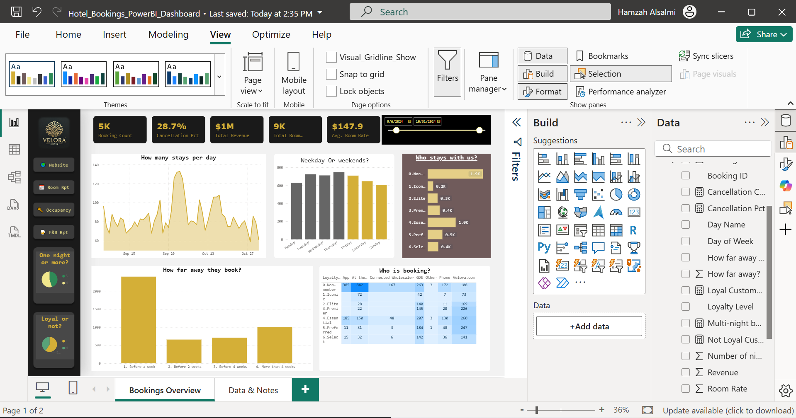
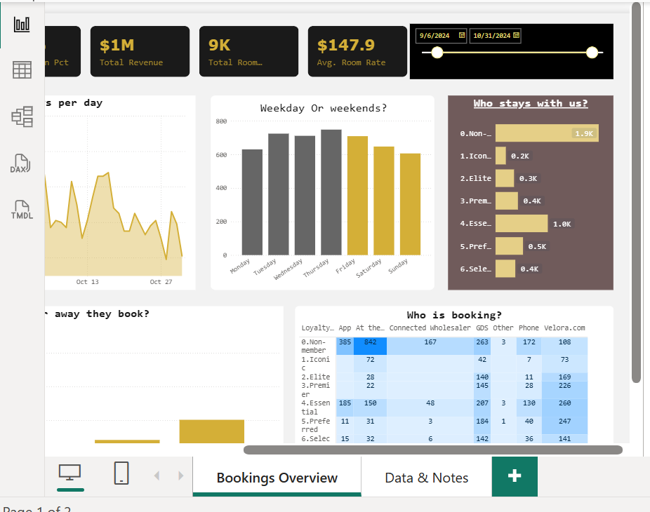

# Power BI Hotel Bookings Dashboard

This project presents an end-to-end **Power BI dashboard** analyzing hotel booking data, with a focus on booking trends, weekday vs. weekend demand, and customer segmentation.

The dashboard was developed following a structured analytics workflow, including data modeling, relationship management, and DAX measure creation, based on best practices demonstrated in professional Power BI tutorials.

---

## 📊 Dashboard Overview

The dashboard provides a high-level view of hotel performance through key metrics such as total bookings, total revenue, average room rate, and cancellation rate.

---

## 🟡 Weekday vs Weekend Demand Analysis

Key insights:
- Booking volume is significantly higher during **weekends (Friday–Sunday)** compared to weekdays
- Weekend demand was intentionally highlighted to make behavioral patterns immediately visible
- This insight can support pricing, staffing, and marketing decisions

---

## 🧮 Data Modeling & DAX Measures

This project demonstrates core Power BI modeling and calculation skills, including:

- Creation of relationships between multiple tables
- Development of calculated measures using **DAX**, such as:
  - Total Bookings
  - Total Revenue
  - Average Room Rate
  - Cancellation Percentage
- Use of date logic to classify bookings as weekday or weekend

---

## 🛠 Tools & Technologies

- Power BI Desktop  
- DAX (Data Analysis Expressions)  
- Data modeling & relationship design  
- Business-focused data visualization  

---

## 🎯 Project Purpose

This project was created as a **portfolio piece** to demonstrate practical Power BI skills, including:
- Translating raw data into business insights
- Designing clear and effective dashboards
- Applying foundational data modeling and DAX techniques

---

## 📁 Repository Contents

- `Hotel_Bookings_PowerBI_Dashboard.pbix` — Power BI dashboard file  
- `Screenshots/` — Dashboard preview images  
- `README.md` — Project documentation
